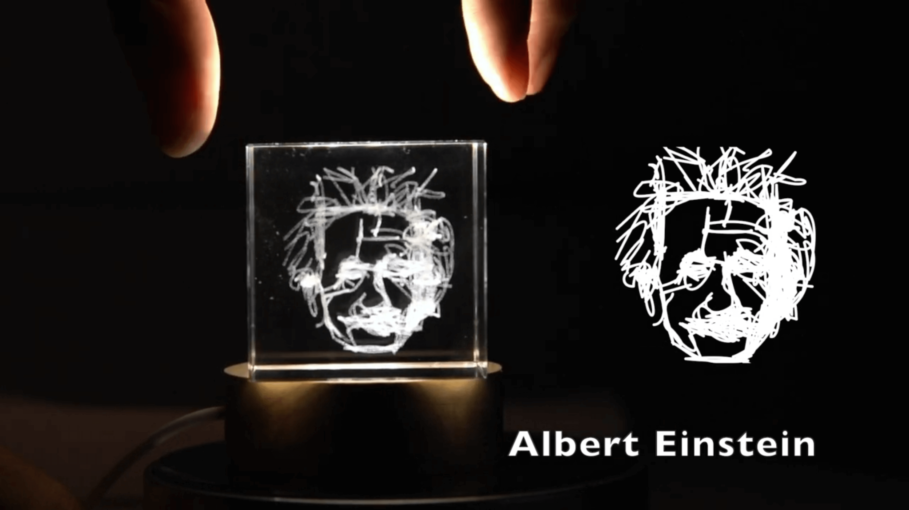

<div align="center">
  
# Wired Perspectives: Multi-View Wire Art <br> Embraces Generative AI

<a href="https://pytorch.org/get-started/locally/"></a>
[](https://arxiv.org/abs/2311.15421)
[](https://cvpr.thecvf.com/)
<a href='https://www.youtube.com/watch?v=CKX3GBrBv58'></a>
<a href="https://dreamwireart.github.io/"></a>
[](https://badges.toozhao.com/stats/01HG0WE973EGR8ENZCAEZR5G4G "Get your own page views count badge on badges.toozhao.com")

</div>

## Video

Click to see our physical artwork!

[](https://youtu.be/8yCUGgnO4vY)

## Abstract

Creating multi-view wire art (MVWA), a static 3D sculpture with diverse interpretations from different viewpoints, is a complex task even for skilled artists. In response, we present *DreamWire*, an AI system enabling everyone to craft MVWA easily. Users express their vision through text prompts or scribbles, freeing them from intricate 3D wire organisation. This is the first AI solution for creating multi-view wire art.


## Link

[Home page](https://dreamwireart.github.io/)

## Citation

```
@inproceedings{qu2023dreamwire,
  title={Wired Perspectives: Multi-View Wire Art Embraces Generative AI},
  author={Qu, Zhiyu and Yang, Lan and Zhang, Honggang and Xiang, Tao and Pang, Kaiyue and Song, Yi-Zhe},
  booktitle={CVPR},
  year={2024}
}
```

## Code

This work is based on [SketchDreamer](https://github.com/WinKawaks/SketchDreamer). Please follow the dependencies of SketchDreamer.

Generate multi-view wire art by text prompts only, use | to split different prompts (recommended):

```
$python run_object_sketching.py --num_sketches 3 --num_segments 4 --num_strokes 64 --train_with_diffusion -display --num_aug_clip 1 --text_prompt 'a_simple_portrait_of_Isaac_Newton|a_simple_portrait_of_Albert_Einstein|a_simple_portrait_of_Alan_Turing' --output_name 'legend' --use_wandb 0
```

Generate multi-view wire art in hybrid mode, use 'white.png' for text only control:

```
$python run_object_sketching.py --num_sketches 3 --num_segments 4 --num_strokes 64 --train_with_diffusion -display --num_aug_clip 1 --text_prompt 'a_simple_portrait_of_Sherlock_Homles|a_simple_portrait_of_Dr._John_Watson|a_simple_portrait_of_London_Tower_Bridge' --output_name 'detective' --use_wandb 0 --control --sketches_edit './edgemaps/sherlock.png|./edgemaps/white.png|./edgemaps/white.png'
```
